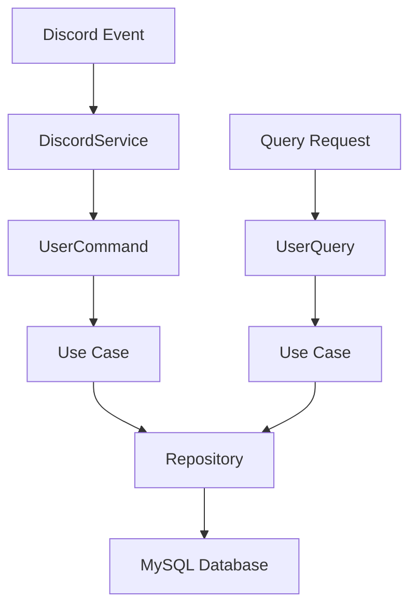

# Documentação Técnica - Checkin Bot

**Status**: ✅ Atualizada - Novembro 2025
**Versão**: 1.0 (Pré-Alpha)

---

## 📋 Visão Geral

O **Checkin Bot** é um bot Discord desenvolvido para o **Coletivo Popular de Design e Desenvolvimento (CPDD)** seguindo os princípios de **Clean Architecture** e **CQRS** (Command Query Responsibility Segregation). O objetivo é monitorar e medir o engajamento dos membros através da coleta automatizada de metadados de interação no servidor Discord.

### Contexto e Motivação

O CPDD precisa de **dados concretos** sobre o comportamento e engajamento dos membros para tomar decisões estratégicas baseadas em evidências, melhorar a retenção de membros e otimizar conteúdos de eventos, cursos e informativos.

## 👥 Pontos Focais

### Diretoria

- @Eder Borella
- @Intra

### Liderança Técnica

- **Desenvolvimento**: @Milena C
- **Dados**: @Paulo Costa

## 🎯 Objetivo e Integração

### Objetivo Principal

Medir o engajamento do coletivo através da coleta de **metadados** do Discord (mensagens, reações, eventos de áudio) para gerar insights estratégicos que apoiem a tomada de decisões sobre melhorias no servidor e estratégias de retenção de membros.

### Integração com Projeto "Dados"

O Checkin Bot é a **primeira ferramenta** de um ecossistema maior de análise de dados do coletivo:

- **Checkin Bot**: Coleta dados de engajamento do Discord
- **Projeto "Dados"**: Analisa e interpreta os dados coletados
- **Outras ferramentas**: Futuras fontes de dados a serem integradas

## 🏢 Áreas Envolvidas

### Desenvolvimento

- Desenvolver e manter o bot Discord
- Implementar coleta automatizada de dados
- Garantir performance, segurança e conformidade
- Manter documentação técnica atualizada

### Dados

- Definir requisitos de coleta com diretorias
- Analisar dados coletados pelo bot
- Criar insights e relatórios estratégicos
- Desenvolver queries e dashboards

## 📊 Status do Projeto

### Versão 1.0 (Pré-Alpha)

#### ✅ FASE 1: Arquitetura e Fundação - **Concluído**

- [x] Clean Architecture implementada
- [x] CQRS (Command Query Responsibility Segregation)
- [x] Camada de repositório (banco de dados)
- [x] Sistema de logging estruturado
- [x] Testes automatizados
- [x] Documentação técnica completa

#### 🔄 FASE 2: Implementação Core - **Em Andamento**

- [x] Casos de uso para usuários
- [x] Integração básica com Discord API
- [ ] Coleta completa de mensagens
- [ ] Coleta de eventos de áudio
- [ ] Coleta de reações
- [ ] Migração da pasta `oldApp/`

#### 📋 FASE 3: Deploy e Validação - **Planejado**

- [ ] Setup ambiente de produção
- [ ] Testes com dados reais
- [ ] Validação com stakeholders
- [ ] Primeiro relatório de engajamento

#### 📋 FASE 4: Integração e Expansão - **Futuro**

- [ ] API de consulta
- [ ] Dashboard básico
- [ ] Integração com projeto "Dados"
- [ ] Otimizações e melhorias

## 🛠️ Stack Tecnológica

### Core

- **Runtime**: Node.js
- **Linguagem**: TypeScript
- **Framework**: Discord.js v14
- **Arquitetura**: Clean Architecture + CQRS

### Database

- **SGBD**: MySQL
- **ORM**: Prisma Client
- **Migrations**: Prisma Migrate
- **Schema**: Normalizado e otimizado

### Testing & Quality

- **Framework de Testes**: Jest
- **Coverage**: ts-jest
- **Linting**: ESLint + Prettier
- **Hooks**: Husky + lint-staged

### DevOps & Deploy

- **Containerização**: Docker + Docker Compose
- **Process Manager**: PM2
- **CI/CD**: GitHub Actions (planejado)
- **Monitoring**: Logs estruturados

## 🏗️ Arquitetura

### Clean Architecture + CQRS

O projeto segue uma estrutura em camadas bem definida que garante:

- **Separação de responsabilidades**
- **Testabilidade e manutenibilidade**
- **Independência de frameworks**
- **Separação entre operações de leitura e escrita**

```
src/
├── domain/           # 🏛️ Camada de Domínio (regras de negócio)
├── application/      # ⚙️ Camada de Aplicação (casos de uso)
├── infrastructure/   # 🔧 Camada de Infraestrutura (implementações externas)
├── contexts/         # 🔌 Dependency Injection e configuração
├── presentation/     # 🖼️ Interface com o usuário (em desenvolvimento)
└── tests/           # 🧪 Testes automatizados
```

### Fluxo de Dados



## 📐 Camadas da Aplicação

### 🏛️ Domain Layer (Domínio)

**Localização**: `src/domain/`
**Status**: ✅ **Completo**

#### Responsabilidades:

- Contém as regras de negócio puras
- Define entidades do domínio
- Especifica interfaces (ports)
- Não depende de nenhuma camada externa

#### Estrutura:

- [6 - Entidades Principais](./6%20-%20Entidades%20Principais.md) (`entities/`) - Modelos de domínio
- `interfaces/` - Contratos para repositórios, serviços e casos de uso
- [7 - Use Cases](./7%20-%20Use%20Cases.md) (`useCases/`) - Implementação das regras de negócio
- `types/` - Enums e tipos customizados
- `dtos/` - Data Transfer Objects

#### Entidades Principais:

1. **User** - Representa usuários do Discord
2. **Channel** - Canais do servidor
3. **Message** - Mensagens enviadas
4. **AudioEvent** - Eventos de áudio/voz
5. **Role** - Cargos dos usuários

**📖 Ver detalhes**: [2 - Domain Layer](./2%20-%20Domain%20Layer.md)

### ⚙️ Application Layer (Aplicação)

**Localização**: `src/application/`
**Status**: 🔄 **Parcial**

#### Responsabilidades:

- Orquestra os casos de uso
- Implementa CQRS
- Coordena entre domain e infrastructure

#### Estrutura:

- `command/` - Handlers para operações de escrita
- `query/` - Handlers para operações de leitura
- `services/` - Serviços da aplicação (Logger)

#### Implementação CQRS:

- **Commands**: UserCommand (orquestra eventos Discord → Use Cases)
- **Queries**: Em desenvolvimento
- **Services**: Logger estruturado

**📖 Ver detalhes**: [3 - Application Layer](./3%20-%20Application%20Layer.md)

### 🔧 Infrastructure Layer (Infraestrutura)

**Localização**: `src/infrastructure/`
**Status**: ✅ **Completo**

#### Responsabilidades:

- Implementa interfaces definidas no domain
- Gerencia comunicação com sistemas externos
- Persistência de dados

#### Estrutura:

- `discord/` - Integração com API do Discord
- `persistence/` - Repositórios e acesso a dados

#### Componentes:

- **DiscordService**: Event handlers e integração Discord.js
- **Repositories**: UserRepository, ChannelRepository, etc.
- **PrismaService**: Gerenciamento de conexão com DB

**📖 Ver detalhes**: [4 - Infrastructure Layer](./4%20-%20Infrastructure%20Layer.md)

### 🔌 Contexts (Injeção de Dependência)

**Localização**: `src/contexts/`
**Status**: ✅ **Completo**

#### Responsabilidades:

- Configuração e inicialização da aplicação
- Dependency Injection manual
- Bootstrap das dependências

#### Arquivos:

- `app.context.ts` - Orquestrador principal
- `database.context.ts` - Configuração do banco
- `discord.context.ts` - Configuração do Discord
- `useUserCases.context.ts` - Instanciação dos casos de uso

**📖 Ver detalhes**: [5 - Contexts](./5%20-%20Contexts.md)

## 📊 Dados Coletados

### ✅ Implementado

**Usuários**

- IDs (interno + Discord)
- Nome de usuário e nome global
- Data de entrada no servidor
- Status (ativo/inativo)
- Timestamps de atividade

### 🔄 Em Implementação

**Mensagens, Eventos de Áudio, Canais, Reações**

- Metadados temporais e relacionamentos
- Contadores e estatísticas
- Status e timestamps

### Relacionamentos

- Users podem ter múltiplos Roles (N:N)
- Users podem enviar Messages (1:N)
- Messages pertencem a Channels (N:1)
- AudioEvents são criados por Users em Channels (N:1:1)

## 🚫 Limitações e Compliance

### O que NÃO coletamos

- ❌ **Conteúdo de mensagens** (texto)
- ❌ **Mídias** (imagens, vídeos, áudios)
- ❌ **Dados pessoais** além de IDs públicos
- ❌ **Automatizações de moderação**

### Conformidade LGPD

- ✅ **Transparência**: Dados especificados nos termos do servidor
- ✅ **Minimização**: Apenas metadados necessários
- ✅ **Segurança**: Acesso restrito e logs auditáveis

## 🔄 Migração da Aplicação Legacy

### ✅ **Migrado para Nova Arquitetura**

- Sistema de usuários (CRUD completo)
- Estrutura base Clean Architecture
- Integração Discord API básica
- Persistência com Prisma
- Sistema de logging
- Testes automatizados

### 🔄 **Em Migração** (`oldApp/` → nova estrutura)

- Coleta de mensagens e eventos
- Sistema de relatórios
- Integrações secundárias

## 🎨 Padrões e Convenções

### Naming Conventions

- **Entities**: `NomeEntity` (ex: `UserEntity`)
- **Interfaces**: `INome` (ex: `IUserRepository`)
- **Use Cases**: `VerbSubject` (ex: `CreateUser`)
- **Commands**: `SubjectCommand` (ex: `UserCommand`)

### Error Handling

- Uso de Result Pattern nos Use Cases
- Logging estruturado com contexto
- Mensagens de erro centralizadas em `types/ErrorMessages.ts`

### Testing Strategy

- Testes unitários para Use Cases
- Testes de integração para Repositories
- Mocks para dependências externas

## 🚀 Próximos Passos

### Prioridade 1 - Completar Migração

- Migrar funcionalidades da pasta `oldApp/`
- Implementar coleta de mensagens e eventos
- Testes de integração completos

### Prioridade 2 - Deploy e Validação

- Setup de ambiente de produção
- Testes com dados reais (sandbox)
- Validação com stakeholders

### Prioridade 3 - Análise Inicial

- Primeiros relatórios de engajamento
- Integração com time de dados

## 📚 Documentação Relacionada

### Documentação de Produto

- [0 - Documentação de Produto](./0%20-%20Documentação%20de%20Produto.md) - Visão de negócio e objetivos

### Documentação Técnica Detalhada

- [🗂️ Índice de Leitura - Checkin Bot](./%F0%9F%97%82%EF%B8%8F%20%C3%8Dndice%20de%20Leitura%20-%20Checkin%20Bot.md) - Guia de navegação
- [2 - Domain Layer](./2%20-%20Domain%20Layer.md) - Regras de negócio e entidades
- [3 - Application Layer](./3%20-%20Application%20Layer.md) - CQRS e orquestração
- [4 - Infrastructure Layer](./4%20-%20Infrastructure%20Layer.md) - Discord + Database
- [5 - Contexts](./5%20-%20Contexts.md) - Dependency Injection
- [6 - Entidades Principais](./6%20-%20Entidades%20Principais.md) - Modelos de dados
- [7 - Use Cases](./7%20-%20Use%20Cases.md) - Casos de uso implementados

---

**🔄 Última atualização**: Novembro 2025
**👥 Mantenedores**: @Milena C, @Paulo Costa
**📧 Contato**: Via Issues do GitHub ou Discord do CPDD
