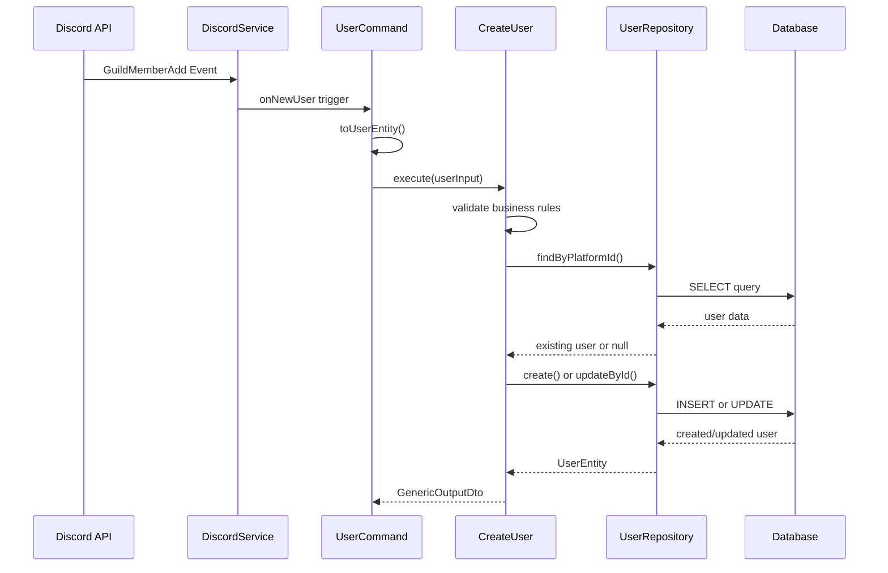

# Application Layer - Checkin Bot

**Status**: ✅ Atualizada - Novembro 2025
**Versão**: 1.0 (Pré-Alpha)

---

## Visão Geral

A camada de aplicação (`src/application/`) atua como orquestradora entre a camada de domínio e a infraestrutura. É responsável por implementar o padrão **CQRS** (Command Query Responsibility Segregation) e coordenar a execução dos casos de uso.

## Estrutura

```
src/application/
├── command/          # Command handlers (operações de escrita)
├── query/            # Query handlers (operações de leitura)
└── services/         # Serviços da aplicação
```

## CQRS Implementation

### Commands (Operações de Escrita)

#### UserCommand

**Arquivo**: `src/application/command/userCommand.ts`

**Responsabilidades**:

- Orquestra os casos de uso relacionados a usuários
- Conecta eventos do Discord aos Use Cases do domínio
- Gerencia o ciclo de vida dos usuários no sistema

**Métodos principais**:

##### `executeNewUser()`

- **Trigger**: Evento `GuildMemberAdd` do Discord
- **Action**: Executa `CreateUser` use case
- **Fluxo**:
  1. Recebe evento de novo membro
  2. Converte `GuildMember` para `CreateUserInput`
  3. Chama `createUser.execute()`
  4. Trata erros e logs

##### `executeAllUsers()`

- **Trigger**: Evento `ClientReady` do Discord
- **Action**: Sincroniza todos os membros do servidor
- **Fluxo**:
  1. Busca todos os membros do guild
  2. Converte para array de `CreateUserInput`
  3. Chama `createUser.executeMany()`

##### `executeUserLeave()`

- **Trigger**: Evento `GuildMemberRemove` do Discord
- **Action**: Marca usuário como inativo
- **Fluxo**:
  1. Recebe evento de membro saindo
  2. Chama `updateUser.executeInvertUserStatus()`

**Integração com Discord**:

```typescript
constructor(
  private readonly discordService: IDiscordService,
  private readonly logger: ILoggerService,
  private readonly createUser: ICreateUser,
  private readonly updateUser: IUpdateUser,
) {
  this.executeNewUser();
  this.executeAllUsers();
  this.executeUserLeave();
}
```

**Mapeamento de Dados**:

```typescript
static toUserEntity(discordUser: GuildMember): CreateUserInput {
  return {
    platformId: discordUser.id,
    username: discordUser.user.username,
    globalName: discordUser.user.globalName,
    bot: discordUser.user.bot,
    status: UserStatus.ACTIVE,
    platformCreatedAt: new Date(discordUser.user.createdTimestamp),
    joinedAt: new Date(discordUser.joinedTimestamp),
    lastActive: undefined,
  };
}
```

### Queries (Operações de Leitura)

#### UserQuery

**Arquivo**: `src/application/query/userQuery.ts`

**Status**: 🚧 Em desenvolvimento (arquivo quase vazio)

**Responsabilidades planejadas**:

- Orquestrar consultas de usuários
- Implementar filtros e paginação
- Retornar dados formatados para apresentação

**Queries planejadas**:

- `getUserById()`
- `getUsersByStatus()`
- `getUsersWithActivity()`
- `getEngagementMetrics()`

## Services

### Logger

**Arquivo**: `src/application/services/Logger.ts`

**Responsabilidades**:

- Sistema de logging estruturado
- Padronização de logs com contexto
- Implementa interface `ILoggerService` do domain

**Funcionalidades**:

- Logs contextuais por camada (REPOSITORY, USECASE, COMMAND, APP_CONTEXT)
- Logs por entidade (USER, CHANNEL, MESSAGE, etc.)
- Níveis de log (ERROR, INFO, WARNING)

**Estrutura do Log**:

```typescript
logToConsole(
  status: LoggerContextStatus,
  context: LoggerContext,
  entity: LoggerContextEntity,
  message: string
): void
```

**Exemplo de uso**:

```typescript
this.logger.logToConsole(
  LoggerContextStatus.ERROR,
  LoggerContext.COMMAND,
  LoggerContextEntity.USER,
  `executeNewUser | ${error.message}`,
);
```

## Fluxo de Execução

### Comando de Criação de Usuário



## Error Handling

### Padrão de Tratamento

- **Try-catch** em todos os métodos públicos
- **Logging estruturado** com contexto completo
- **Não propagação** de exceções para camadas superiores
- **Logs detalhados** para debugging

### Exemplo:

```typescript
async executeNewUser(): Promise<void> {
  try {
    this.discordService.onNewUser(async (member) => {
      await this.createUser.execute(UserCommand.toUserEntity(member));
    });
  } catch (error) {
    this.logger.logToConsole(
      LoggerContextStatus.ERROR,
      LoggerContext.COMMAND,
      LoggerContextEntity.USER,
      `executeNewUser | ${error.message}`,
    );
  }
}
```

## Dependency Injection

A camada de aplicação recebe suas dependências através do **contexts**:

**Em `app.context.ts`**:

```typescript
// Dependências externas
const logger = new Logger();
const { userRepository } = initializeDatabase(logger);
const { discordService } = initializeDiscord();

// Dependências internas
const userUseCases = initializeUserUseCases(userRepository, logger);

// Inicialização da aplicação
new UserCommand(
  discordService,
  logger,
  userUseCases.createUserCase,
  userUseCases.updateUserCase,
);
```

## Status da Implementação

### ✅ Implementado

- UserCommand com integração Discord completa
- Sistema de logging estruturado
- Mapeamento de eventos Discord para Use Cases
- Error handling padronizado

### 🚧 Em Desenvolvimento

- UserQuery para operações de leitura
- Métricas de engajamento
- Relatórios automáticos

### 📋 Planejado

- Commands para outras entidades (Message, Channel, AudioEvent)
- Queries complexas com agregações
- Event handlers para relatórios
- Sistema de notificações

## Padrões Aplicados

### Command Pattern

- Encapsula requisições como objetos
- Permite logging e auditoria
- Facilita testing com mocks

### Observer Pattern

- Discord events são observados pelos Commands
- Desacoplamento entre Discord API e business logic

### Adapter Pattern

- Converte dados do Discord para formato do domínio
- `toUserEntity()` method adapta GuildMember para CreateUserInput

## Relacionamento com Outras Camadas

- **Domain**: Usa interfaces e Use Cases definidos no domain
- **Infrastructure**: Recebe implementações via dependency injection
- **Contexts**: É instanciada e configurada pelos contexts

---

**Links Relacionados**:

- [1 - Documentação técnica](./1%20-%20Documentação%20técnica.md)
- [2 - Domain Layer](./2%20-%20Domain%20Layer.md)
- [4 - Infrastructure Layer](./4%20-%20Infrastructure%20Layer.md)
- [5 - Contexts](./5%20-%20Contexts.md)
- [3 - Application Layer](./3%20-%20Application%20Layer.md) (Commands são parte desta camada)
- [7 - Use Cases](./7%20-%20Use%20Cases.md)
