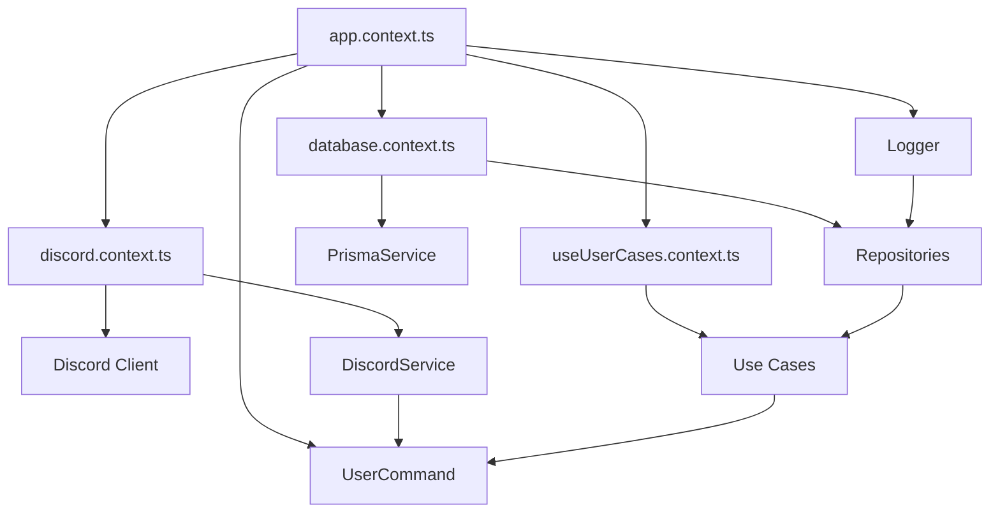

# Contexts - Dependency Injection

**Status**: ✅ Atualizada - Novembro 2025
**Versão**: 1.0 (Pré-Alpha)

---

## Visão Geral

Os contexts (`src/contexts/`) são responsáveis pela **configuração e inicialização** de toda a aplicação. Implementam um sistema de **Dependency Injection manual** que garante a correta instanciação e injeção das dependências seguindo os princípios da Clean Architecture.

## Estrutura

```
src/contexts/
├── app.context.ts           # Orquestrador principal
├── database.context.ts      # Configuração do banco de dados
├── discord.context.ts       # Configuração do Discord client
└── useUserCases.context.ts  # Instanciação dos casos de uso
```

## App Context - Orquestrador Principal

**Arquivo**: `src/contexts/app.context.ts`

### Responsabilidades

- **Bootstrap** de toda a aplicação
- **Ordem de inicialização** das dependências
- **Error handling** de configuração
- **Environment validation**

### Fluxo de Inicialização

```typescript
export function initializeApp() {
  // 1. Dependências externas (sem dependências internas)
  const logger = new Logger();
  const { userRepository } = initializeDatabase(logger);
  const { discordService } = initializeDiscord();
  const { TOKEN_BOT } = process.env;

  // 2. Validação de ambiente
  if (!TOKEN_BOT) {
    logger.logToConsole(
      LoggerContextStatus.ERROR,
      LoggerContext.APP_CONTEXT,
      LoggerContextEntity.USER,
      ErrorMessages.MISSING_SECRET,
    );
  }

  // 3. Dependências internas (que dependem das externas)
  const userUseCases = initializeUserUseCases(userRepository, logger);

  // 4. Inicialização dos comandos (Application Layer)
  new UserCommand(
    discordService,
    logger,
    userUseCases.createUserCase,
    userUseCases.updateUserCase,
  );

  // 5. Registro de eventos e login
  discordService.registerEvents();
  discordService.client.login(TOKEN_BOT);
}
```

### Ordem de Dependências

1. **Logger** (sem dependências)
2. **Database** (depende do logger)
3. **Discord Service** (sem dependências internas)
4. **Environment Variables** (validação)
5. **Use Cases** (dependem de repository + logger)
6. **Commands** (dependem de service + logger + use cases)
7. **Event Registration** (deve ser após commands)
8. **Discord Login** (por último)

## Database Context

**Arquivo**: `src/contexts/database.context.ts`

### Responsabilidades

- **Instanciar** PrismaService
- **Configurar** repositórios
- **Injetar** logger nos repositórios

### Implementação

```typescript
export function initializeDatabase(logger: ILoggerService) {
  const prismaService = new PrismaService();

  const userRepository = new UserRepository(prismaService, logger);
  const channelRepository = new ChannelRepository(prismaService, logger);
  const messageRepository = new MessageRepository(prismaService, logger);
  const audioEventRepository = new AudioEventRepository(prismaService, logger);
  const roleRepository = new RoleRepository(prismaService, logger);
  const messageReactionRepository = new MessageReactionRepository(
    prismaService,
    logger,
  );

  return {
    prismaService,
    userRepository,
    channelRepository,
    messageRepository,
    audioEventRepository,
    roleRepository,
    messageReactionRepository,
  };
}
```

### Padrão Aplicado

- **Factory Pattern**: Função que retorna conjunto configurado de repositories
- **Dependency Injection**: Logger é injetado em todos os repositories
- **Single Responsibility**: Cada repository é responsável por uma entidade

## Discord Context

**Arquivo**: `src/contexts/discord.context.ts`

### Responsabilidades

- **Configurar** Discord.js client
- **Definir** intents necessários
- **Instanciar** DiscordService

### Event Intents Mapping

```typescript
const EVENT_INTENTS_MAP = {
  // User events
  GuildMemberAdd: GatewayIntentBits.GuildMembers,
  GuildMemberRemove: GatewayIntentBits.GuildMembers,

  // Message events
  MessageCreate: GatewayIntentBits.GuildMessages,
  MessageReactionAdd: GatewayIntentBits.GuildMessageReactions,

  // Voice events
  VoiceStateUpdate: GatewayIntentBits.GuildVoiceStates,
};
```

### Implementação

```typescript
export function initializeDiscord() {
  const client = new Client({
    intents: [
      GatewayIntentBits.Guilds,
      GatewayIntentBits.GuildMembers,
      GatewayIntentBits.GuildMessages,
      GatewayIntentBits.GuildMessageReactions,
      GatewayIntentBits.GuildVoiceStates,
    ],
  });

  const discordService = new DiscordService(client);

  return {
    client,
    discordService,
  };
}
```

### Intent Guidelines

- **Documentação** de quais intents são necessários para cada evento
- **Mapeamento claro** entre eventos e intents
- **Comentários** sobre exceções (eventos que compartilham intents)

## Use Cases Context

**Arquivo**: `src/contexts/useUserCases.context.ts`

### Responsabilidades

- **Instanciar** todos os Use Cases
- **Injetar** dependências (repositories + logger)
- **Organizar** por entidade

### Implementação

```typescript
export function initializeUserUseCases(
  userRepository: IUserRepository,
  logger: ILoggerService,
) {
  const createUserCase = new CreateUser(userRepository, logger);
  const updateUserCase = new UpdateUser(userRepository, logger);
  const findUserCase = new FindUser(userRepository, logger);
  const deleteUserCase = new DeleteUser(userRepository, logger);

  return {
    createUserCase,
    updateUserCase,
    findUserCase,
    deleteUserCase,
  };
}
```

### Padrão de Organização

- **Agrupamento por entidade** (User, Message, Channel, etc.)
- **Nomenclatura consistente**: `[verb][Entity]Case`
- **Injeção explícita** de todas as dependências

## Dependency Injection Pattern

### Manual DI vs Framework

**Escolha**: Manual Dependency Injection

**Motivos**:

- **Simplicidade**: Sem complexidade adicional de framework
- **Transparência**: Dependências explícitas e rastreáveis
- **Performance**: Sem overhead de reflection
- **Type Safety**: TypeScript garante tipos em compile time

### Fluxo de Dependências



### Vantagens da Abordagem

- **Ordem explícita** de inicialização
- **Error handling** centralizado na configuração
- **Testing**: Fácil substituição por mocks
- **Debugging**: Stack trace claro das dependências

## Environment Configuration

### Variables Validation

```typescript
const { TOKEN_BOT } = process.env;

if (!TOKEN_BOT) {
  logger.logToConsole(
    LoggerContextStatus.ERROR,
    LoggerContext.APP_CONTEXT,
    LoggerContextEntity.USER,
    ErrorMessages.MISSING_SECRET,
  );
}
```

### Required Environment Variables

- **`TOKEN_BOT`**: Token do Discord bot
- **`DATABASE_URL`**: String de conexão MySQL
- **`NODE_ENV`**: Ambiente (development/production/test)

## Error Handling Strategy

### Configuration Errors

- **Early failure**: Falha rápida se configuração inválida
- **Structured logging**: Logs contextuais para debug
- **Graceful degradation**: Onde possível, fallbacks

### Initialization Errors

- **Try-catch** around critical initialization
- **Detailed error messages** com contexto
- **Process exit** para erros críticos

## Testing Support

### Test Contexts

```typescript
// Para testes, contexts podem ser modificados:
export function initializeTestApp() {
  const logger = new MockLogger();
  const { userRepository } = initializeTestDatabase(logger);
  // ... configuração específica de teste
}
```

### Mock Injection

- **Easy mocking**: Substituição simples de dependências
- **Isolation**: Cada teste pode ter seu próprio context
- **Performance**: Evita setup desnecessário em testes

## Migration Strategy

### Legacy Integration

```typescript
// Durante migração, contexts podem incluir código legado:
export function initializeLegacySupport() {
  // Inicializar sistemas novos
  const newSystems = initializeApp();

  // Manter sistemas legados temporariamente
  const legacySystems = initializeOldApp();

  return { ...newSystems, ...legacySystems };
}
```

### Gradual Migration

1. **Dual systems**: Novo e antigo rodando em paralelo
2. **Feature flags**: Habilitar/desabilitar sistemas
3. **Progressive rollout**: Migração gradual de funcionalidades

## Future Enhancements

### Planned Improvements

- **Configuration files**: YAML/JSON para configurações complexas
- **Service discovery**: Para microservices
- **Health checks**: Validação de dependências externas
- **Graceful shutdown**: Cleanup de recursos

---

**Links Relacionados**:

- [1 - Documentação técnica](./1%20-%20Documentação%20técnica.md)
- [2 - Domain Layer](./2%20-%20Domain%20Layer.md)
- [3 - Application Layer](./3%20-%20Application%20Layer.md)
- [4 - Infrastructure Layer](./4%20-%20Infrastructure%20Layer.md)
- [5 - Contexts](./5%20-%20Contexts.md) (Dependency Injection está documentado aqui)
