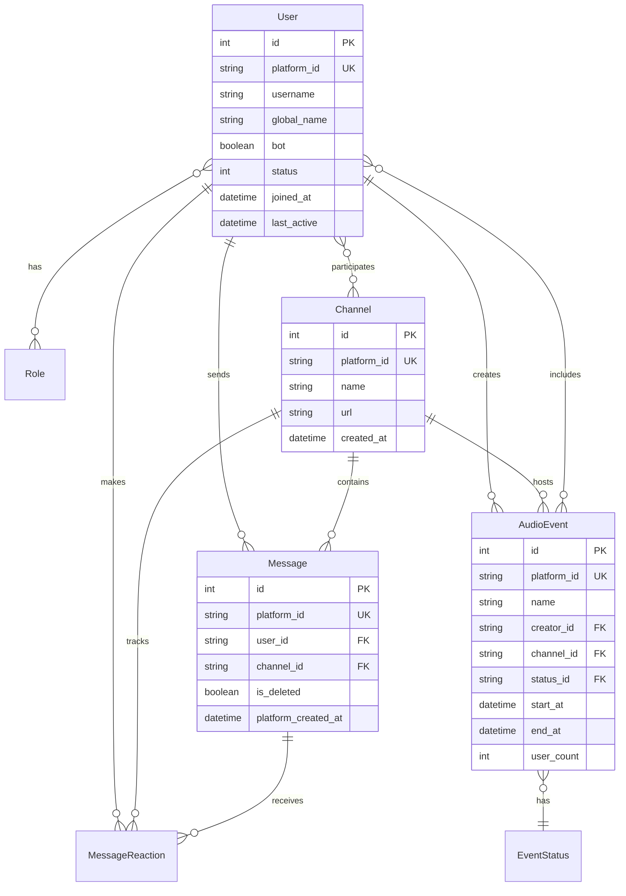

# Entidades Principais - Checkin Bot

**Status**: ✅ Atualizada - Novembro 2025
**Versão**: 1.0 (Pré-Alpha)

---

## Visão Geral

As entidades representam os conceitos centrais do domínio de negócio do Checkin Bot. Cada entidade encapsula dados e comportamentos relacionados a um conceito específico do Discord e do sistema de engajamento.

## Estrutura das Entidades

```
src/domain/entities/
├── User.ts              # Usuários do Discord
├── Channel.ts           # Canais do servidor
├── Message.ts           # Mensagens enviadas
├── AudioEvent.ts        # Eventos de áudio/voz
├── MessageReaction.ts   # Reações em mensagens
├── Role.ts              # Cargos dos usuários
├── EventStatus.ts       # Status dos eventos
└── LogEvent.ts          # Eventos de log
```

## Core Entities

### 👤 User Entity

**Arquivo**: `src/domain/entities/User.ts`

**Propósito**: Representa um usuário do Discord no sistema de engajamento.

#### Propriedades

| Campo               | Tipo         | Descrição                         |
| ------------------- | ------------ | --------------------------------- |
| `id`                | `number`     | Identificador interno único       |
| `platformId`        | `string`     | ID do usuário no Discord          |
| `username`          | `string`     | Nome de usuário do Discord        |
| `globalName`        | `string?`    | Nome global do Discord            |
| `bot`               | `boolean`    | Se é um bot ou usuário real       |
| `status`            | `UserStatus` | Status no sistema (ativo/inativo) |
| `joinedAt`          | `Date?`      | Data de entrada no servidor       |
| `platformCreatedAt` | `Date?`      | Data de criação da conta Discord  |
| `createAt`          | `Date?`      | Data de criação no sistema        |
| `updateAt`          | `Date?`      | Data da última atualização        |
| `lastActive`        | `Date?`      | Última atividade registrada       |
| `email`             | `string?`    | Email do usuário (opcional)       |

#### Regras de Negócio

- **Bots são filtrados**: Não são persistidos no sistema
- **Platform ID é único**: Não permite duplicatas
- **Status padrão**: Novos usuários são marcados como ACTIVE
- **Reativação automática**: Usuários inativos são reativados ao retornar

#### Factory Method

```typescript
public static fromPersistence(user: User): UserEntity {
  return new UserEntity(
    user.id,
    user.platform_id,
    user.username,
    user.bot,
    user.status,
    user.global_name,
    user.joined_at,
    user.platform_created_at,
    user.create_at,
    user.update_at,
    user.last_active,
    user.email,
  );
}
```

### 🎵 AudioEvent Entity

**Arquivo**: `src/domain/entities/AudioEvent.ts`

**Propósito**: Representa eventos de áudio/voz (reuniões, calls) no Discord.

#### Propriedades

| Campo         | Tipo             | Descrição               |
| ------------- | ---------------- | ----------------------- |
| `id`          | `number`         | Identificador interno   |
| `platformId`  | `string`         | ID do evento no Discord |
| `name`        | `string`         | Nome do evento          |
| `description` | `string?`        | Descrição opcional      |
| `statusId`    | `string`         | Status do evento (FK)   |
| `startAt`     | `Date`           | Data/hora de início     |
| `endAt`       | `Date`           | Data/hora de fim        |
| `userCount`   | `number`         | Número de participantes |
| `image`       | `string?`        | Imagem associada        |
| `createdAt`   | `Date`           | Data de criação         |
| `channel`     | `ChannelEntity?` | Canal onde ocorreu      |
| `creator`     | `UserEntity?`    | Usuário criador         |

#### Relacionamentos

- **Creator**: Muitos eventos para um usuário (N:1)
- **Channel**: Muitos eventos para um canal (N:1)
- **Status**: Muitos eventos para um status (N:1)
- **Participants**: Many-to-Many com usuários via `userEvent`

### 💬 Message Entity

**Arquivo**: `src/domain/entities/Message.ts`

**Propósito**: Representa mensagens enviadas nos canais do Discord.

#### Propriedades

| Campo               | Tipo                      | Descrição                  |
| ------------------- | ------------------------- | -------------------------- |
| `id`                | `number?`                 | Identificador interno      |
| `platformId`        | `string`                  | ID da mensagem no Discord  |
| `platformCreatedAt` | `Date`                    | Data de criação no Discord |
| `isDeleted`         | `boolean`                 | Se foi deletada            |
| `createdAt`         | `Date?`                   | Data de criação no sistema |
| `channel`           | `ChannelEntity?`          | Canal onde foi enviada     |
| `user`              | `UserEntity?`             | Usuário que enviou         |
| `messageReactions`  | `MessageReactionEntity[]` | Reações na mensagem        |

#### Características

- **Soft Delete**: Mensagens deletadas são marcadas, não removidas
- **Platform Tracking**: Data original do Discord é preservada
- **Rich Relationships**: Conecta usuários, canais e reações

### 📺 Channel Entity

**Arquivo**: `src/domain/entities/Channel.ts`

**Propósito**: Representa canais do servidor Discord.

#### Propriedades

| Campo             | Tipo                       | Descrição              |
| ----------------- | -------------------------- | ---------------------- |
| `id`              | `number`                   | Identificador interno  |
| `platformId`      | `string`                   | ID do canal no Discord |
| `name`            | `string`                   | Nome do canal          |
| `url`             | `string`                   | URL do canal           |
| `createdAt`       | `Date`                     | Data de criação        |
| `user`            | `UserEntity[]?`            | Usuários do canal      |
| `message`         | `MessageEntity[]?`         | Mensagens do canal     |
| `messageReaction` | `MessageReactionEntity[]?` | Reações do canal       |

#### Agregações

- **Message Count**: Quantidade de mensagens
- **Active Users**: Usuários ativos no canal
- **Engagement Metrics**: Métricas de interação

### 🎭 Role Entity

**Arquivo**: `src/domain/entities/Role.ts`

**Propósito**: Representa cargos/funções dos usuários no Discord.

#### Propriedades

| Campo               | Tipo     | Descrição                  |
| ------------------- | -------- | -------------------------- |
| `id`                | `number` | Identificador interno      |
| `name`              | `string` | Nome do cargo              |
| `platformId`        | `string` | ID do cargo no Discord     |
| `platformCreatedAt` | `Date`   | Data de criação no Discord |
| `createdAt`         | `Date`   | Data de criação no sistema |

#### Relacionamentos

- **Users**: Many-to-Many através de `UserRole`
- **Permissions**: Diferentes níveis de acesso

### 👍 MessageReaction Entity

**Arquivo**: `src/domain/entities/MessageReaction.ts`

**Propósito**: Representa reações (emojis) em mensagens.

#### Propriedades

| Campo       | Tipo     | Descrição             |
| ----------- | -------- | --------------------- |
| `id`        | `number` | Identificador interno |
| `userId`    | `string` | ID do usuário (FK)    |
| `messageId` | `string` | ID da mensagem (FK)   |
| `channelId` | `string` | ID do canal (FK)      |

#### Características

- **Engagement Tracking**: Mede interação dos usuários
- **Analytics**: Base para métricas de engajamento
- **Unique Constraint**: Um usuário, uma reação por mensagem

## Supporting Entities

### 🏷️ EventStatus Entity

**Arquivo**: `src/domain/entities/EventStatus.ts`

**Propósito**: Define os possíveis status dos eventos de áudio.

#### Status Típicos

- `SCHEDULED`: Evento agendado
- `ACTIVE`: Evento em andamento
- `COMPLETED`: Evento finalizado
- `CANCELLED`: Evento cancelado

### 📝 LogEvent Entity

**Arquivo**: `src/domain/entities/LogEvent.ts`

**Propósito**: Representa eventos de log estruturado do sistema.

## Padrões de Design Aplicados

### Entity Pattern

- **Identity**: Cada entidade tem um ID único
- **Encapsulation**: Dados e comportamentos juntos
- **Business Rules**: Regras de negócio na entidade

### Factory Pattern

- **fromPersistence()**: Cria entidade a partir de dados do banco
- **Type Safety**: Garante tipos corretos na criação
- **Mapping Logic**: Centraliza conversão de dados

### Value Objects

- **UserStatus**: Enum para status do usuário
- **LoggerContext**: Contextos para logging
- **Immutability**: Propriedades readonly quando apropriado

## Relacionamentos Entre Entidades



## Mapeamento Domain ↔ Database

### Naming Convention

- **Domain**: `camelCase` (platformId, createdAt)
- **Database**: `snake_case` (platform_id, created_at)
- **Mapping**: Feito nos repositories via métodos `toDomain()` e `toPersistence()`

### Type Mapping

- **Domain**: `Date` objects
- **Database**: `DateTime` fields
- **Domain**: `boolean`
- **Database**: `Boolean`
- **Domain**: `number`
- **Database**: `Int`

## Evolution Strategy

### Adding New Entities

1. **Create entity class** em `domain/entities/`
2. **Define interface** em `domain/interfaces/repositories/`
3. **Implement repository** em `infrastructure/persistence/repositories/`
4. **Update schema** em `schema.prisma`
5. **Create migration** com Prisma
6. **Add to contexts** para DI

### Modifying Existing Entities

1. **Update entity class** (manter backward compatibility)
2. **Update database schema**
3. **Create migration**
4. **Update mapping methods** em repositories
5. **Update tests**

---

**Links Relacionados**:

- [1 - Documentação técnica](./1%20-%20Documentação%20técnica.md)
- [2 - Domain Layer](./2%20-%20Domain%20Layer.md)
- [4 - Infrastructure Layer](./4%20-%20Infrastructure%20Layer.md)
- [4 - Infrastructure Layer](./4%20-%20Infrastructure%20Layer.md) (Database schema está documentado aqui)
- [4 - Infrastructure Layer](./4%20-%20Infrastructure%20Layer.md) (Repository pattern está documentado aqui)
