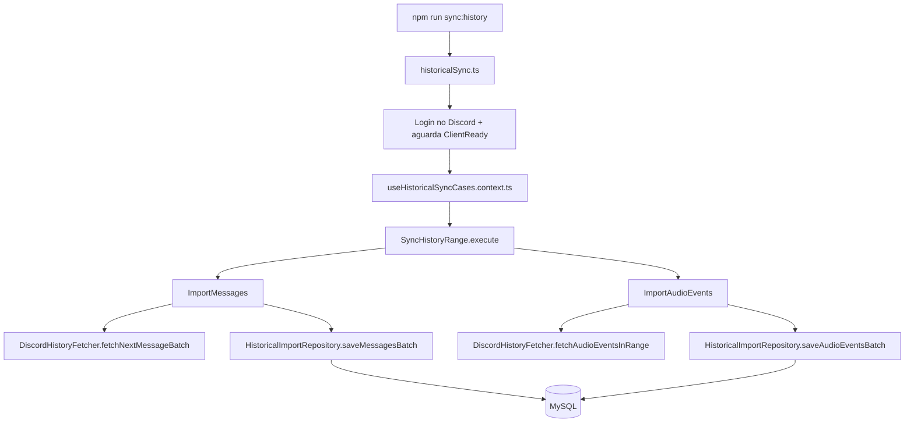

# Sincronização Histórica (Backfill)

**Status**: ✅ Implementado
**Versão**: 1.0

---

## Visão Geral

A sincronização histórica é um fluxo **paralelo e independente** do consumidor em tempo real (`DiscordService` + `application/command/*Command.ts`). Ela existe para popular o banco com dados que já existiam no servidor Discord **antes** do bot começar a rodar, através de um script CLI de execução única (_Single Execution Strategy_), sem tocar no caminho do bot ao vivo.

**⚠️ Escopo dos dados**: este backfill só importa **mensagens** e **eventos de voz/áudio** (Discord Scheduled Events). Ele não importa reações, cargos, nem histórico de entrada/saída de usuários — esses continuam existindo apenas a partir do momento em que o bot está rodando e capturando os eventos do gateway em tempo real.

**⚠️ Limitação de eventos de voz**: a API REST de Guild Scheduled Events do Discord **não tem filtro por intervalo de datas** e **não retém eventos concluídos/passados indefinidamente**. O backfill importa o que `guild.scheduledEvents.fetch()` retornar no momento da execução, filtrado no lado do cliente pelo intervalo `startDate`/`endDate` pedido. Ou seja, a cobertura de eventos de voz antigos será **parcial** — isso é uma limitação conhecida da API do Discord, não um bug do bot.

## Por que existe separado do fluxo em tempo real

|                         | Fluxo em tempo real                               | Sincronização histórica                                     |
| ----------------------- | ------------------------------------------------- | ----------------------------------------------------------- |
| **Trigger**             | Eventos do gateway Discord (push)                 | Script CLI (`npm run sync:history`)                         |
| **Direção**             | Discord → bot (evento chega)                      | Bot → Discord (busca ativamente / pull)                     |
| **Onde vive**           | `application/command/*Command.ts`                 | `src/historicalSync.ts` (não integrado a `initializeApp()`) |
| **Repositórios usados** | `MessageRepository`, `AudioEventRepository`, etc. | `HistoricalImportRepository` (dedicado)                     |
| **Quando roda**         | Continuamente, enquanto o bot está online         | Sob demanda, uma vez por intervalo de datas                 |

Os repositórios existentes (`MessageRepository`, `AudioEventRepository`, `ChannelRepository`, `UserRepository`) **não são usados nem modificados** pelo backfill — isso minimiza o risco de regressão no caminho que já está em produção.

## Arquitetura

```
src/
├── domain/
│   ├── interfaces/
│   │   ├── services/IDiscordHistoryFetcher.ts        # Contrato do fetcher
│   │   ├── repositories/IHistoricalImportRepository.ts
│   │   └── useCases/{message,audioEvent,sync}/I*.ts
│   ├── useCases/
│   │   ├── message/ImportMessages.ts                 # Pagina mensagens em lotes
│   │   ├── audioEvent/ImportAudioEvents.ts            # Busca e importa eventos em chunks
│   │   └── sync/SyncHistoryRange.ts                   # Orquestra os dois, com isolamento de falha
│   └── types/DiscordEventTypes.ts                     # Helpers de status compartilhados com VoiceEventCommand
├── infrastructure/
│   ├── discord/fetchers/DiscordHistoryFetcher.ts       # Busca dados brutos via discord.js
│   └── persistence/repositories/HistoricalImportRepository.ts  # Escreve em transações, idempotente
├── contexts/useHistoricalSyncCases.context.ts          # Wiring de DI isolado do app.context.ts
└── historicalSync.ts                                   # Entry point da CLI (irmão de index.ts)
```

### Fluxo de execução



`SyncHistoryRange` roda `ImportMessages` e depois `ImportAudioEvents`, cada um dentro do seu próprio try/catch — uma falha em um não interrompe o outro, e o resultado final traz as contagens e mensagens de erro de cada um separadamente.

### Fetcher (`DiscordHistoryFetcher`)

- `fetchNextMessageBatch({ startDate, endDate, batchSize, cursor? })`: resolve a guild da mesma forma que `userCommand.ts` já faz, lista os canais de texto (`ChannelType.GuildText`) uma vez, e pagina cada canal via `channel.messages.fetch({ limit: 100, before })` — o limite de 100 é do próprio Discord, então o fetcher pagina múltiplas vezes **sequencialmente** (nunca em paralelo) até juntar `batchSize` mensagens ou esgotar todos os canais. Devolve `{ messages, cursor, done }`; o `cursor` (índice do canal + id da última mensagem) permite que o use case dirija o loop lote a lote sem o fetcher guardar estado entre chamadas.
- `fetchAudioEventsInRange({ startDate, endDate })`: uma única chamada a `guild.scheduledEvents.fetch({ withUserCount: true })`, filtrada no cliente por `scheduledStartAt` dentro do intervalo.
- Mensagens de bots são descartadas automaticamente, assim como no fluxo em tempo real (`messageCommand.ts`).

### Repositório (`HistoricalImportRepository`)

Cada lote é gravado em **uma única transação** (`prisma.$transaction`):

1. Upsert de canais e usuários por `platform_id` (idempotente — seguro rodar o mesmo intervalo mais de uma vez).
2. Upsert do `EventStatus` necessário (mesmo padrão de `AudioEventRepository.findOrCreateEventStatus`).
3. `message.createMany({ skipDuplicates: true })` para mensagens; `audioEvent.upsert` por evento (permite reimportar sem duplicar nem quebrar em uma re-execução parcial).

## Como executar via CLI

### 1. Pré-requisitos

- `.env` configurado com `TOKEN_BOT` (token do bot Discord) e `DATABASE_URL` apontando para o banco que você quer popular.
- O bot precisa estar **no servidor (guild)** e ter permissão para ler o histórico dos canais de texto que você quer importar.
- Dependências instaladas (`npm install`).

### 2. Rodar o comando

```bash
npm run sync:history -- --start=2026-01-01 --end=2026-04-01 --batchSize=1000
```

| Argumento     | Obrigatório | Formato                  | Padrão se omitido  |
| ------------- | ----------- | ------------------------ | ------------------ |
| `--start`     | Não         | `YYYY-MM-DD` ou ISO 8601 | Hoje menos 3 meses |
| `--end`       | Não         | `YYYY-MM-DD` ou ISO 8601 | Data/hora atual    |
| `--batchSize` | Não         | inteiro                  | `1000`             |

Rodar sem nenhum argumento (`npm run sync:history`) importa os últimos 3 meses com lotes de 1000 registros.

### 3. O que esperar na saída

```
Iniciando sincronização histórica de 2026-01-01T00:00:00.000Z até 2026-04-01T00:00:00.000Z, batchSize=1000
[MESSAGE] lote 1 — 1000 registros importados até agora
[MESSAGE] lote 2 — 1842 registros importados até agora
[AUDIO_EVENT] lote 1 — 12 registros importados até agora
Resumo final:
  Mensagens: fetched=1842 created=1842 skipped=0 failed=0
  Eventos de áudio: fetched=12 created=12 skipped=0 failed=0
```

- `created` = registros novos gravados nesta execução.
- `skipped` = já existiam (idempotência via `platform_id`) — normal ao reprocessar um intervalo já importado.
- `failed` = registros que não foram gravados por erro (checar os logs `ERROR` acima do resumo para detalhes).

Em caso de erro fatal (ex.: `TOKEN_BOT` ausente, falha de conexão com o Discord/DB), a mensagem é impressa em `stderr` e o processo termina com código de saída `1`.

### 4. Conferir o resultado

```bash
npm run db:studio
```

Abra as tabelas `message` e `audio_event` e confira se os registros aparecem com `platform_created_at`/`start_at` dentro do intervalo pedido.

### 5. Rodando pelo GitHub Actions (alternativa à CLI local)

Existe um workflow `workflow_dispatch` em [`.github/workflows/historical-sync.yml`](../.github/workflows/historical-sync.yml), independente do build de imagem (`docker-publish.yml`) e dos testes de PR (`ci.yml`). Ele expõe os mesmos três parâmetros (`start_date`, `end_date`, `batch_size`) pela UI do GitHub Actions.

**Pré-requisito único**: os secrets `TOKEN_BOT` e `DATABASE_URL` (apontando para o ambiente que deve ser preenchido) precisam estar cadastrados no repositório/ambiente do GitHub Actions — isso não é feito automaticamente, precisa ser configurado manualmente nas configurações do repositório.

## Reexecução e idempotência

É seguro rodar o mesmo intervalo de datas mais de uma vez: canais e usuários são upsertados por `platform_id`, mensagens usam `skipDuplicates`, e eventos de áudio usam `upsert`. Isso é útil se uma execução for interrompida no meio — basta rodar de novo com o mesmo `--start`/`--end`.

## O que este backfill **não** faz

- ❌ Não importa reações de mensagens (`MessageReaction`).
- ❌ Não importa histórico de entrada/saída de usuários (`UserEvent`).
- ❌ Não importa mudanças de cargo (`Role`/`UserRole`).
- ❌ Não garante cobertura completa de eventos de voz antigos — depende do que a API do Discord ainda retiver no momento da execução.
- ❌ Não roda automaticamente — é sempre um comando manual (local ou via `workflow_dispatch`).

---

**Links Relacionados**:

- [1 - Documentação técnica](./1%20-%20Documentação%20técnica.md)
- [5 - Contexts](./5%20-%20Contexts.md)
- [7 - Use Cases](./7%20-%20Use%20Cases.md)
