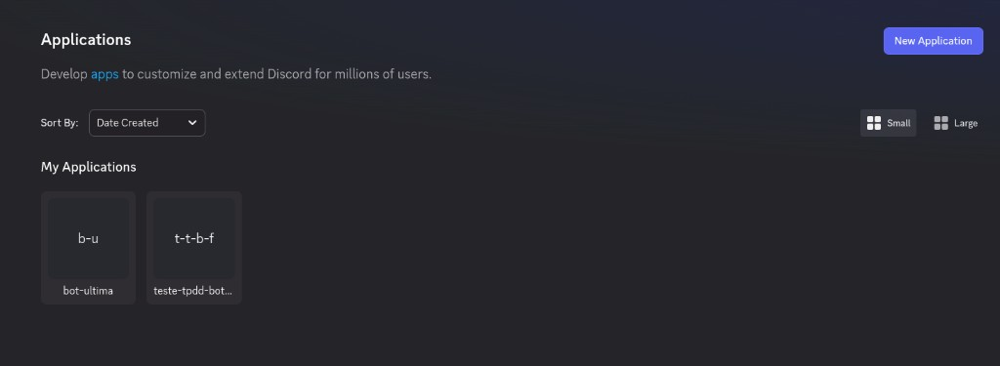
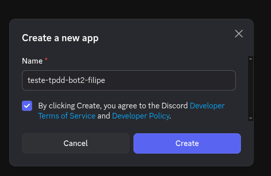
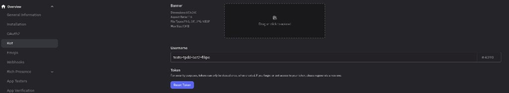
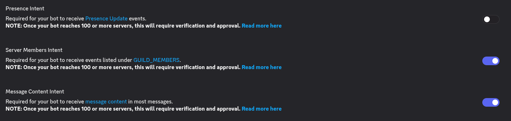
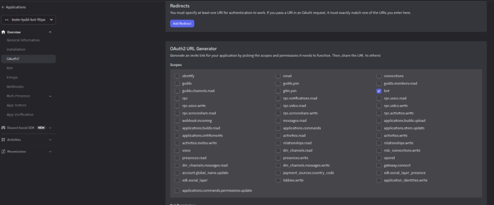
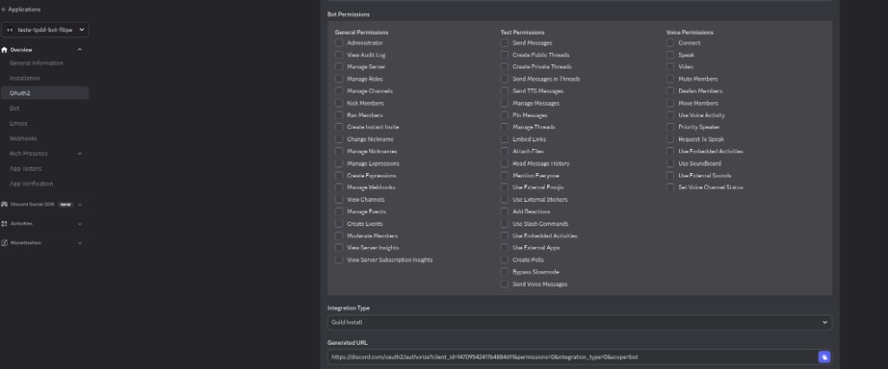
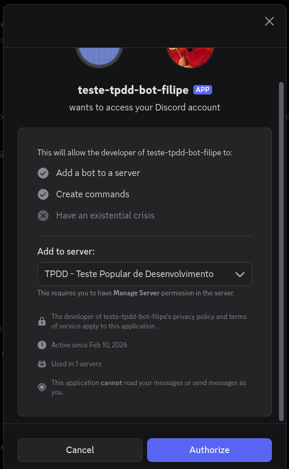

# 🤖 Como criar um bot no Discord

Este guia descreve os passos para criar um bot no Discord Developer Portal e quais informações você precisa obter para configurar o **Checkin Discord Bot**.

---

## 📋 Informações que você vai precisar

| Informação       | Onde obter                | Uso no projeto                 |
| ---------------- | ------------------------- | ------------------------------ |
| **Token do bot** | Bot → Token (Reset Token) | Variável `TOKEN_BOT` no `.env` |
| **Client ID**    | OAuth2 → URL gerada       | URL de convite e integrações   |

A **URL de convite** é gerada no OAuth2 e usada para adicionar o bot ao servidor (ex.: TPDD - Teste Popular de Desenvolvimento).

---

## 1. Acessar o Discord Developer Portal

1. Acesse: [Discord Developer Portal — Applications](https://discord.com/developers/applications).
2. Faça login na sua conta Discord, se necessário.
3. Você verá a lista **My Applications** e o botão **New Application**.



---

## 2. Criar uma nova aplicação

1. Clique em **New Application**.
2. No modal **Create a new app**:
   - **Name \***: use o formato `teste-tpdd-bot-seu-nome` (ex.: `teste-tpdd-bot-filipe`).
   - Marque o checkbox: _By clicking Create, you agree to the Discord Developer Terms of Service and Developer Policy._
3. Clique em **Create**.



---

## 3. Obter o Token do bot

1. No menu lateral da aplicação, clique em **Bot**.
2. Na seção **Username**, confira o nome do bot (ex.: `teste-tpdd-bot2-filipe#4398`).
3. Na seção **Token**:
   - Se for a primeira vez, clique em **Reset Token** e confirme. O token será exibido **apenas uma vez**.
   - **Copie o token** e guarde em local seguro (ele será usado no `.env` como `TOKEN_BOT`).

> ⚠️ **Segurança:** Nunca compartilhe o token. Se perder, gere um novo em **Reset Token** e atualize o `.env`.



---

## 4. Permissões de Intents

1. No menu lateral da aplicação, clique em **Bot**.
2. Na seção **Privileged Gateway Intents**, ative **Server Members Intent**. O projeto usa `guild.members.fetch()` tanto na inicialização quanto na sincronização histórica.

O código também solicita intents não privilegiados para servidores, mensagens, reações, eventos agendados e estados de voz. Não há leitura do conteúdo textual das mensagens, portanto o projeto atual não solicita `MessageContent`.



---

## 5. Configurar OAuth2 e escopos

1. No menu lateral, clique em **OAuth2**.
2. Em **OAuth2 URL Generator**:
   - Em **Scopes**, marque **bot** para adicionar o bot ao servidor.
   - `applications.commands` não é necessário no código atual, pois não há slash commands implementados.
3. Mais abaixo, em **Bot Permissions**, conceda somente o necessário para os canais que serão coletados, especialmente **View Channels** e **Read Message History**. O bot atual não envia mensagens nem administra cargos no Discord.



---

## 6. Gerar a URL de convite

1. Ainda em **OAuth2**, role até **Integration Type** e **Generated URL**.
2. Em **Integration Type**, deixe **Guild Install** (instalação por servidor).
3. A **Generated URL** será algo como:
   ```text
   https://discord.com/oauth2/authorize?client_id=SEU_CLIENT_ID&permissions=...&integration_type=0&scope=bot
   ```
4. **Copie o Client ID** da URL (número após `client_id=`). Você pode precisar dele para outras integrações.



Use a URL gerada pelo portal depois de selecionar apenas as permissões necessárias. Evite copiar um número fixo de `permissions`, pois ele é difícil de auditar e pode conceder acessos além do escopo atual.

---

## 7. Adicionar o bot ao servidor

1. Abra a **URL de convite** gerada no navegador (com seu `client_id`).
2. Na tela de autorização:
   - Revise as permissões solicitadas para o bot.
   - Em **Add to server**, escolha o servidor **TPDD - Teste Popular de Desenvolvimento** (é necessário ter permissão **Manage Server** nesse servidor).
3. Clique em **Authorize** e conclua o captcha, se aparecer.



---

## 8. Configurar o projeto

1. No repositório do bot, crie ou edite o arquivo `.env` na raiz.
2. Defina pelo menos:
   ```env
   TOKEN_BOT=seu-token-copiado-do-developer-portal
   ```
3. Configure também `DB_HOST`, `DB_PORT`, `DB_PASSWORD`, `DB_DATABASE` e `DATABASE_URL` conforme o [README](../README.md#-instalação).

Depois disso, você pode subir o bot com `npm run dev` ou via Docker conforme a documentação do projeto.

---

## 📌 Resumo

1. **Discord Developer Portal** → New Application → nome `teste-tpdd-bot-seu-nome`.
2. **Bot** → Reset Token → copiar token → `TOKEN_BOT` no `.env`.
3. **OAuth2** → marcar scope **bot** → ajustar as permissões mínimas → copiar **Generated URL** e **Client ID**.
4. Abrir a URL de convite → selecionar servidor TPDD → **Authorize**.
5. Configurar `.env` e rodar o bot.

Para mais detalhes de instalação e Docker, veja o [README do projeto](../README.md).
